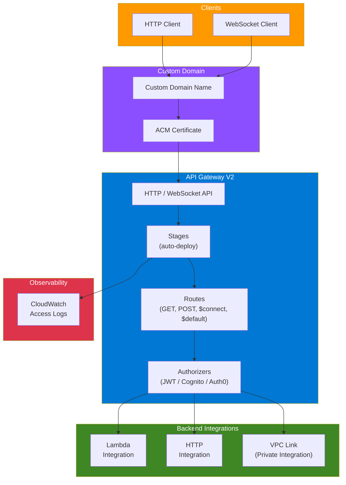

# terraform-aws-api-gateway-v2

Terraform module to create and manage AWS API Gateway V2 (HTTP and WebSocket APIs).

## Architecture Diagram



## Features

- HTTP and WebSocket API Gateway support
- JWT authorizers (Cognito, Auth0, etc.)
- VPC Links for private integrations
- Custom domain names with ACM certificates
- Stage management with auto-deploy
- Access logging with CloudWatch
- Route-level throttling configuration
- CORS configuration (HTTP APIs)
- Disable default execute-api endpoint

## Usage

### Basic HTTP API

```hcl
module "api_gateway" {
  source = "github.com/kogunlowo123/terraform-aws-api-gateway-v2"

  name          = "my-http-api"
  description   = "My HTTP API"
  protocol_type = "HTTP"

  routes = {
    "get-hello" = {
      method          = "GET"
      path            = "/hello"
      integration_uri = aws_lambda_function.hello.invoke_arn
    }
  }

  stages = {
    "$default" = {
      auto_deploy = true
    }
  }
}
```

### WebSocket API

```hcl
module "websocket_api" {
  source = "github.com/kogunlowo123/terraform-aws-api-gateway-v2"

  name          = "my-websocket-api"
  protocol_type = "WEBSOCKET"

  routes = {
    "connect" = {
      path            = "$connect"
      integration_uri = aws_lambda_function.ws_connect.invoke_arn
    }
    "disconnect" = {
      path            = "$disconnect"
      integration_uri = aws_lambda_function.ws_disconnect.invoke_arn
    }
    "default" = {
      path            = "$default"
      integration_uri = aws_lambda_function.ws_default.invoke_arn
    }
  }

  stages = {
    "production" = {
      auto_deploy = true
    }
  }
}
```

### With JWT Authorizer and Custom Domain

```hcl
module "api_gateway" {
  source = "github.com/kogunlowo123/terraform-aws-api-gateway-v2"

  name          = "secure-api"
  protocol_type = "HTTP"

  routes = {
    "get-users" = {
      method          = "GET"
      path            = "/users"
      integration_uri = aws_lambda_function.get_users.invoke_arn
      authorizer_key  = "cognito"
    }
  }

  authorizers = {
    "cognito" = {
      type     = "JWT"
      issuer   = "https://cognito-idp.us-east-1.amazonaws.com/${aws_cognito_user_pool.main.id}"
      audience = [aws_cognito_user_pool_client.main.id]
    }
  }

  domain_name            = "api.example.com"
  domain_certificate_arn = aws_acm_certificate.api.arn

  stages = {
    "$default" = {
      auto_deploy = true
    }
  }
}
```

## Examples

- [Basic](examples/basic/) - Simple HTTP API with a single route
- [Advanced](examples/advanced/) - HTTP API with JWT authorizer, VPC Link, and throttling
- [Complete](examples/complete/) - Full-featured HTTP and WebSocket APIs with all options

## Requirements

| Name | Version |
|------|---------|
| terraform | >= 1.0 |
| aws | >= 5.0 |

## Inputs

| Name | Description | Type | Default | Required |
|------|-------------|------|---------|----------|
| name | The name of the API Gateway | `string` | n/a | yes |
| description | The description of the API Gateway | `string` | `""` | no |
| protocol_type | The API protocol type (HTTP or WEBSOCKET) | `string` | `"HTTP"` | no |
| cors_configuration | CORS configuration for HTTP APIs | `object` | `null` | no |
| routes | Map of route configurations | `map(object)` | `{}` | no |
| integrations | Map of integration configurations | `map(any)` | `{}` | no |
| authorizers | Map of authorizer configurations | `map(object)` | `{}` | no |
| stages | Map of stage configurations | `map(object)` | `{}` | no |
| vpc_links | Map of VPC Link configurations | `map(object)` | `{}` | no |
| domain_name | Custom domain name | `string` | `null` | no |
| domain_certificate_arn | ARN of the ACM certificate for the custom domain | `string` | `null` | no |
| disable_execute_api_endpoint | Whether to disable the default execute-api endpoint | `bool` | `false` | no |
| tags | A map of tags to assign to resources | `map(string)` | `{}` | no |

## Outputs

| Name | Description |
|------|-------------|
| api_id | The ID of the API Gateway |
| api_arn | The ARN of the API Gateway |
| api_endpoint | The URI of the API Gateway |
| api_execution_arn | The execution ARN of the API Gateway |
| stage_ids | Map of stage names to their IDs |
| stage_arns | Map of stage names to their ARNs |
| stage_invoke_urls | Map of stage names to their invoke URLs |
| route_ids | Map of route keys to their IDs |
| integration_ids | Map of integration keys to their IDs |
| authorizer_ids | Map of authorizer names to their IDs |
| vpc_link_ids | Map of VPC link names to their IDs |
| vpc_link_arns | Map of VPC link names to their ARNs |
| domain_name | The custom domain name |
| domain_name_target | The target domain name for DNS configuration |
| domain_name_hosted_zone_id | The Route 53 hosted zone ID for the custom domain |
| log_group_arns | Map of stage names to their CloudWatch Log Group ARNs |

## License

MIT License. See [LICENSE](LICENSE) for full details.
